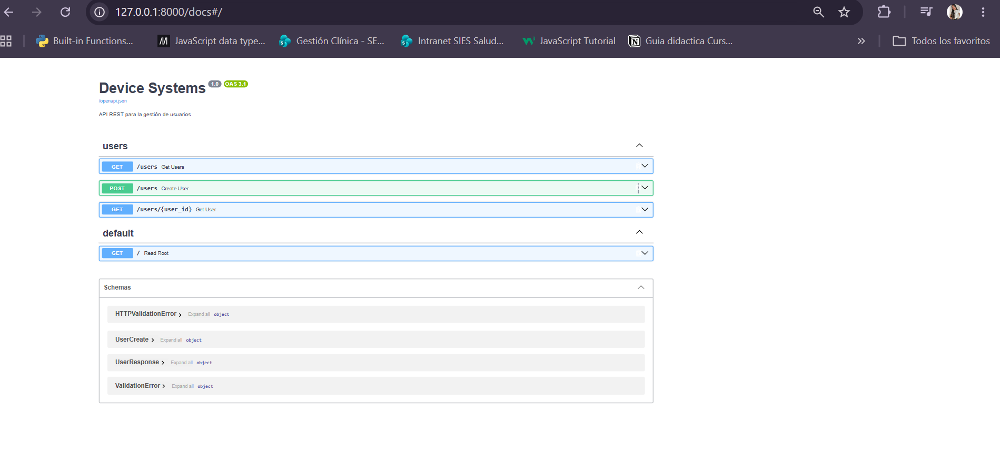
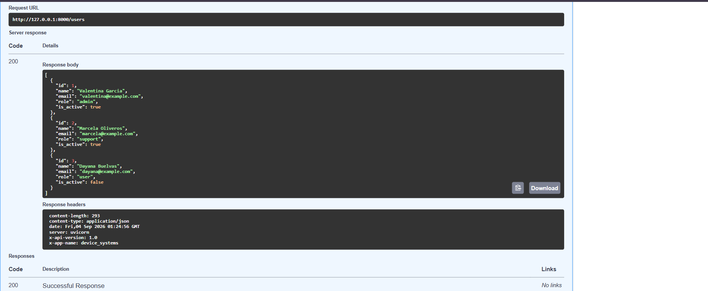
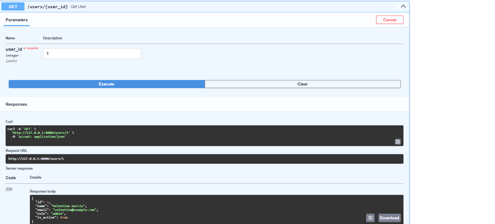
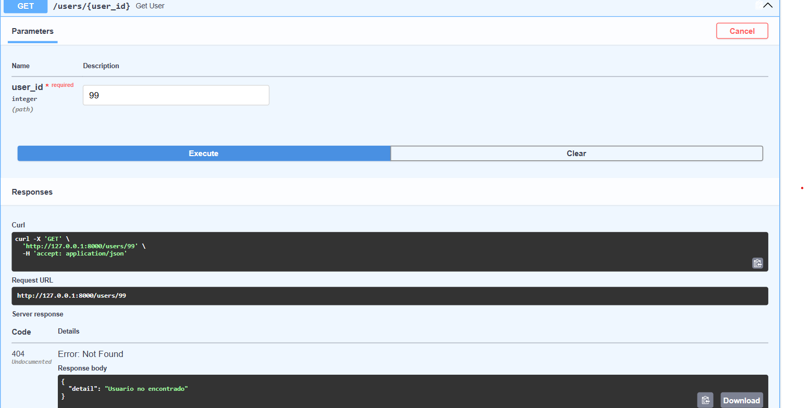
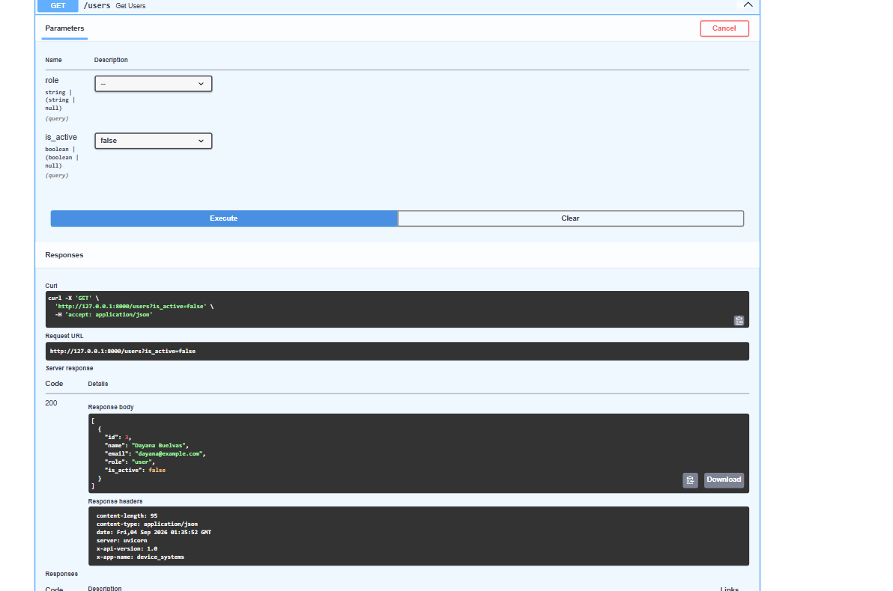
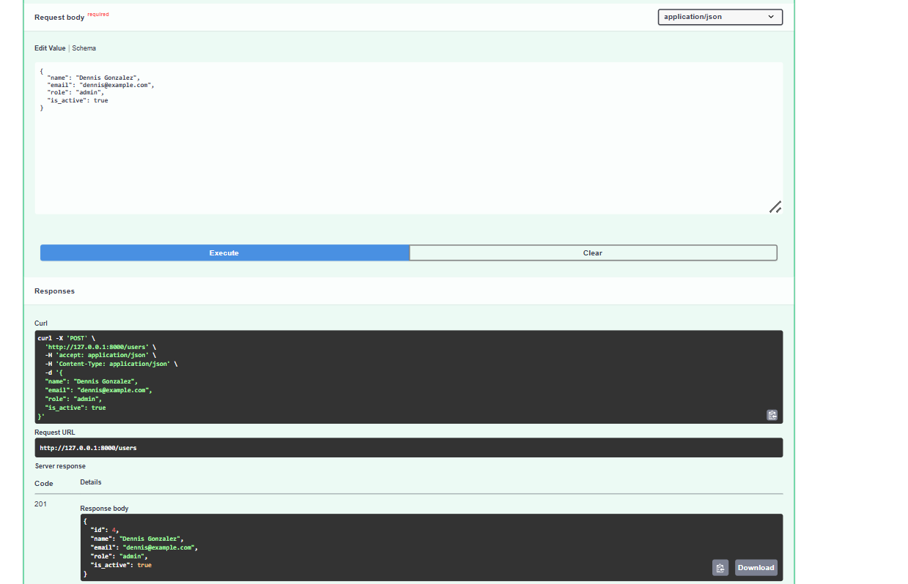
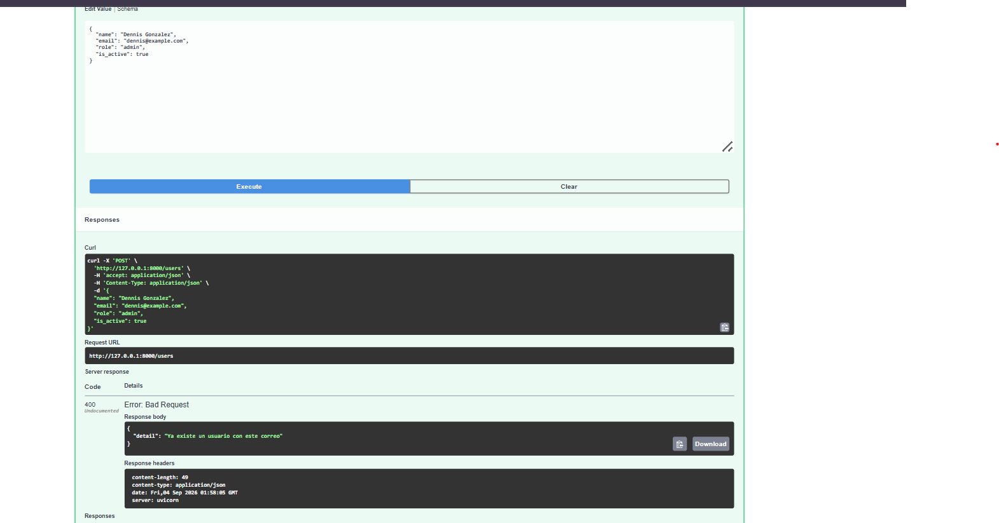
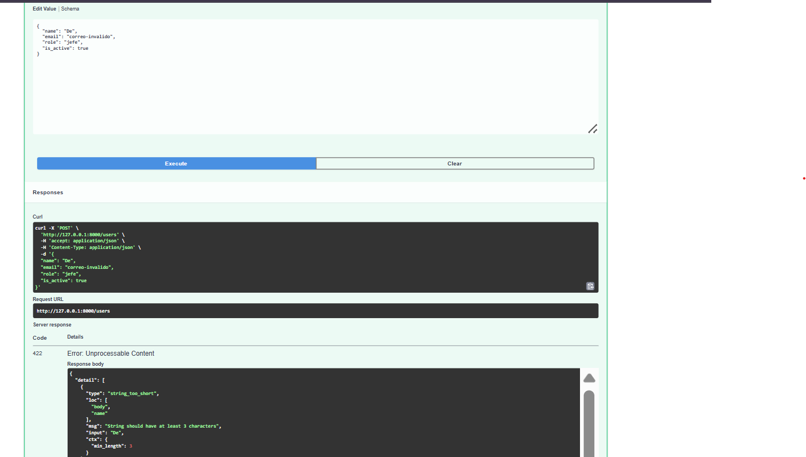

# device_systems

Backend desarrollado con **FastAPI** para la gestión de usuarios mediante una API REST.

## Tecnologías utilizadas

- Python
- FastAPI
- Uvicorn
- Pydantic
- Swagger / OpenAPI
- Git y GitHub

## Funcionalidades

La API permite:

- Listar usuarios.
- Consultar un usuario por ID.
- Crear nuevos usuarios.
- Filtrar usuarios por rol.
- Filtrar usuarios por estado activo o inactivo.
- Validar los datos enviados mediante Pydantic.
- Validar correos duplicados.
- Manejar diferentes códigos de estado HTTP.
- Consultar y probar los endpoints mediante Swagger UI.

## Endpoints

| Método | Endpoint           | Descripción                |
| ------ | ------------------ | -------------------------- |
| GET    | `/users`           | Lista todos los usuarios   |
| GET    | `/users/{user_id}` | Consulta un usuario por ID |
| POST   | `/users`           | Crea un nuevo usuario      |

### Filtros disponibles

El endpoint `GET /users` permite utilizar los siguientes parámetros:

- `role`: filtra por `admin`, `support` o `user`.
- `is_active`: filtra usuarios activos o inactivos.

Ejemplo:

```text
/users?role=admin
/users?is_active=false
```

## Códigos de estado

La API utiliza diferentes códigos HTTP según el resultado de la petición:

- `200 OK`: consulta realizada correctamente.
- `201 Created`: usuario creado correctamente.
- `400 Bad Request`: el correo del usuario ya existe.
- `404 Not Found`: usuario no encontrado.
- `422 Unprocessable Content`: los datos enviados no cumplen las validaciones definidas.

## Validaciones

Los datos de los usuarios son validados mediante modelos de **Pydantic**.

Se validan campos como:

- Nombre.
- Correo electrónico.
- Rol.
- Estado del usuario.

## Documentación automática

FastAPI genera automáticamente la documentación de la API mediante **Swagger UI**.

Con el servidor ejecutándose se puede consultar en:

```text
http://127.0.0.1:8000/docs
```

## Ejecutar el proyecto

Activar el entorno virtual e instalar las dependencias:

```bash
pip install -r requirements.txt
```

Ejecutar el servidor:

```bash
uvicorn app.main:app --reload
```

El servidor estará disponible en:

```text
http://127.0.0.1:8000
```

## Evidencias

### Documentación de la API en Swagger

En Swagger UI se visualizan los endpoints implementados para la gestión de usuarios.



### Consulta de usuarios - GET /users

Se realiza la consulta general de usuarios obteniendo una respuesta exitosa con código HTTP 200.



### Consulta de usuario por ID - GET /users/{user_id}

Se consulta un usuario específico mediante un Path Parameter.



### Manejo de error 404

Al consultar un usuario que no existe, la API responde con el código HTTP 404 y el mensaje correspondiente.



### Filtro de usuarios por estado

Se utiliza el Query Parameter `is_active=false` para consultar únicamente los usuarios inactivos.



### Creación de usuario - POST /users

Se crea un nuevo usuario enviando los datos mediante el Request Body. La API responde con el código HTTP 201 Created.



### Validación de correo duplicado

La API valida que no exista previamente un usuario con el mismo correo electrónico. En caso de duplicidad responde con código HTTP 400.



### Validación de datos con Pydantic

Pydantic valida automáticamente los datos enviados. Cuando los datos no cumplen las reglas definidas, FastAPI devuelve una respuesta HTTP 422.



## Autor

Dennis Gonzalez
